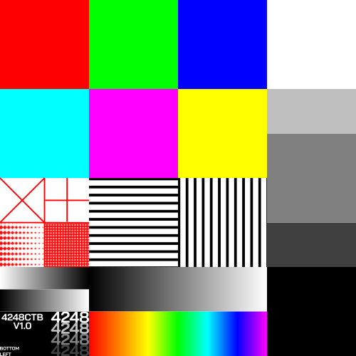

# CTB

CTB (Colour test bars) is a open source, public domain, colour test image. It is designed to test the colour accuracy of displays, printers, cameras, and other imaging devices. 

The image comes as a SVG file and is also rendered as a PNG in various sizes.

## License

CTB is released into the public domain (CC-0). You can copy, modify, distribute and perform the work, even for commercial purposes, all without asking permission. Please see the [Creative Commons Zero license](https://creativecommons.org/publicdomain/zero/1.0/) for more information.